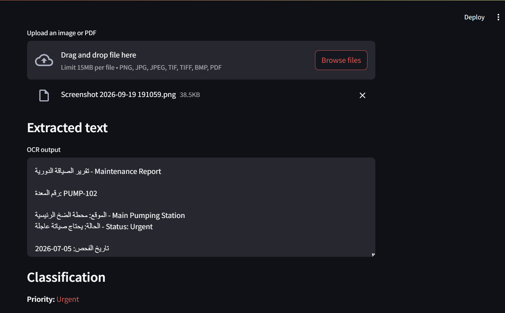

# Arabic Engineering Document Intelligence System

An OCR + NLP system for reading Arabic industrial maintenance and safety reports, extracting
the information they contain, and automatically classifying them by priority.

Maintenance teams in Arabic-speaking industrial environments generate large volumes of
scanned reports and photographed forms — equipment inspection notes, safety observations,
incident logs — that are slow to review manually and hard to search or aggregate. This
project turns those documents into structured, classified text: it reads mixed Arabic/English
text out of scanned images and PDFs, then uses a fine-tuned Arabic language model to flag how
urgent each report is (`Urgent` / `Normal` / `Low`), so teams can triage a backlog of reports
without reading every one by hand.



## Features

- **OCR extraction** — pulls mixed Arabic/English text out of images and PDFs using
  Tesseract, with image preprocessing (grayscale + adaptive thresholding) to improve accuracy
  on scanned documents. EasyOCR can be switched in as an alternative engine.
- **Report classification** — classifies report text into `Urgent`, `Normal`, or `Low`
  priority using a lightweight classification head trained on top of frozen AraBERT sentence
  embeddings.
- **REST API** — FastAPI service to upload reports, list/filter processed reports by
  priority, get per-priority statistics, and download the original file. Interactive docs at
  `/docs`.
- **Persistence** — every processed report (OCR text, priority, metadata) is saved in
  PostgreSQL, with schema migrations managed by Alembic.
- **File storage** — uploaded originals are kept on local disk in development or in
  **Amazon S3** in production, behind one storage interface.
- **Interactive dashboard** — Streamlit app to upload a report, see its extracted text and
  priority, and browse the history of processed reports.
- **Containerized** — one Docker image (Tesseract, Arabic language data and AraBERT baked
  in) and a Docker Compose stack: PostgreSQL + API + dashboard.

## Architecture

```
                 ┌──────────────┐  HTTP   ┌──────────────────────────────┐
  user ────────▶ │  Streamlit   │ ──────▶ │           FastAPI            │
                 │  dashboard   │         │  OCR (Tesseract) → AraBERT   │
                 └──────────────┘         └──────┬───────────────┬───────┘
                                                 │               │
                                          ┌──────▼─────┐   ┌─────▼──────┐
                                          │ PostgreSQL │   │ S3 / disk  │
                                          │  results   │   │ originals  │
                                          └────────────┘   └────────────┘
```

More detail and design decisions: [docs/architecture.md](docs/architecture.md).

## Tech Stack

| Layer | Technology |
|---|---|
| API | FastAPI, Pydantic |
| OCR | Tesseract `ara+eng` (EasyOCR optional), OpenCV preprocessing, Poppler for PDFs |
| NLP | AraBERT (`aubmindlab/bert-base-arabertv02`) + PyTorch classification head |
| Dashboard | Streamlit |
| Database | PostgreSQL, SQLAlchemy (async), Alembic |
| Storage / Infrastructure | Amazon S3, EC2, IAM roles, Docker, Docker Compose |
| Quality | pytest, Ruff, GitHub Actions (tests + Docker build + smoke test) |

## Project Structure

```
arabic-engineering-doc-intelligence/
├── src/app/
│   ├── api/              # FastAPI app, routes, response schemas
│   ├── core/             # Settings (environment variables)
│   ├── db/               # SQLAlchemy models + async session
│   ├── storage/          # Local disk / S3 storage backends
│   ├── services/         # OCR → classification pipeline (shared by API + dashboard)
│   ├── ocr/              # OCR engine and image processing
│   └── nlp/              # AraBERT encoder, classification head, training
├── app/main.py           # Streamlit dashboard
├── migrations/           # Alembic database migrations
├── scripts/              # Model download, container entrypoint
├── deployment/aws/       # EC2 + S3 deployment guide, user-data, IAM policy
├── tests/                # pytest suite (API, storage, OCR routing, classifier, data)
├── Dockerfile
└── docker-compose.yml
```

## Quick Start (Docker — recommended)

Requires Docker only; Tesseract, Arabic language data and AraBERT are inside the image.

```bash
docker compose up --build
```

- Dashboard: http://localhost:8501
- API docs: http://localhost:8000/docs

## Local Setup (without Docker)

```bash
python -m venv venv
venv\Scripts\activate          # Windows
# source venv/bin/activate     # Linux / macOS
pip install -r requirements-dev.txt
copy .env.example .env         # Linux / macOS: cp .env.example .env
```

OCR requires a local Tesseract installation (with the Arabic `ara` language data) and Poppler
(for PDF support). Set `TESSERACT_CMD`, `TESSDATA_PREFIX`, and `POPPLER_PATH` in `.env` if
they aren't discoverable on your system `PATH`.

Download AraBERT once and train the classification head (takes seconds on CPU):

```bash
python -m scripts.download_model
python -m src.app.nlp.train
```

Run the dashboard on its own (runs the pipeline in-process, no database needed):

```bash
streamlit run app/main.py
```

Or run the API (SQLite by default; set `DATABASE_URL` for PostgreSQL):

```bash
alembic upgrade head
uvicorn src.app.api.main:app --reload
```

## API

| Method | Endpoint | Description |
|---|---|---|
| `POST` | `/api/v1/documents` | Upload an image/PDF → OCR + classify + store; returns the result |
| `GET` | `/api/v1/documents?priority=Urgent` | List processed reports (newest first, filterable, paginated) |
| `GET` | `/api/v1/documents/stats` | Number of reports per priority |
| `GET` | `/api/v1/documents/{id}` | One report with its full extracted text |
| `GET` | `/api/v1/documents/{id}/file` | Download the original file |
| `GET` | `/health` | Health check |

```bash
curl -F "file=@data/samples/sample_engineering_doc.png" http://localhost:8000/api/v1/documents
```

## Testing

```bash
pytest -q
ruff check .
```

The API tests replace OCR/AraBERT with a fake processor and use a temporary SQLite database,
and the S3 tests run against `moto` (an in-memory AWS mock), so the suite needs no
Tesseract, model weights, Postgres or AWS account. CI additionally builds the Docker image
and runs a real OCR + AraBERT smoke test inside it.

## Deployment

See [deployment/aws/README.md](deployment/aws/README.md) — single EC2 instance with Docker
Compose, uploads in S3 via an IAM role (no access keys in the code or `.env`).

## Known Limitations

- The classifier is trained on synthetic, template-based reports; accuracy on real-world
  reports is not yet measured.
- OCR quality drops on skewed or low-contrast phone photos.

## License

MIT — see [LICENSE](LICENSE).
